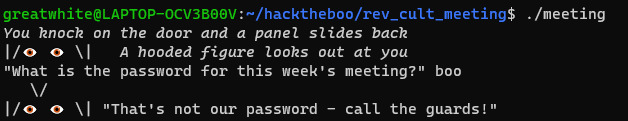
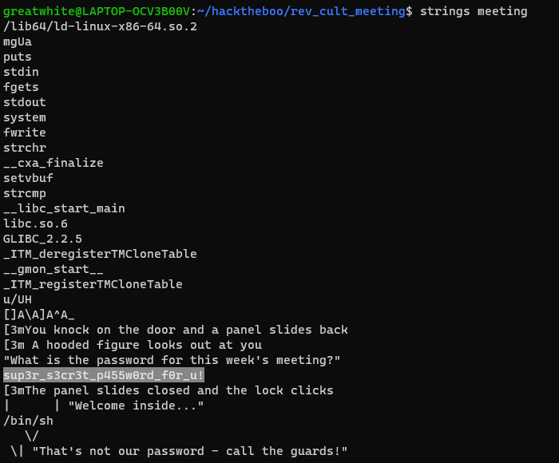
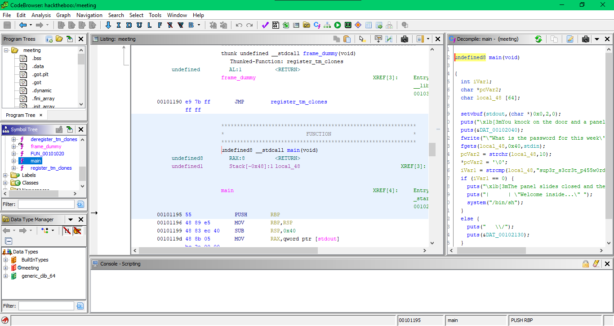
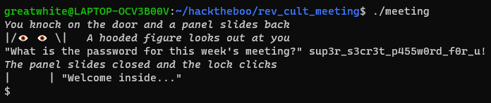
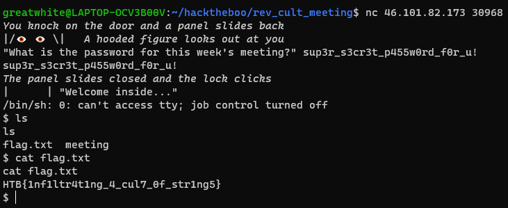

# Cult Meeting
@ChallengeAuthor: clubby789 (Tony_Bamanaboni)\
@WriteupAuthor: [MrSharkSpamBot]\
**DISCLAMER: I DO NOT OWN ANY OF THE FILES IN ```rev_cult_meeting.zip```.**

## Description
After months of research, you're ready to attempt to infiltrate the meeting of a shadowy cult. Unfortunately, it looks like they've changed their password!

## Solving The Challenge
Running the challenge file, ```meeting```, we can see that it asks for a password. The obvious answer is ```boo``` so lets try that.


Running the ```strings``` command on the file, we find an interesting string.


Lets open up the ```meeting``` file up in [ghidra] and go to the main function to try to find out the use of this string.


The decompiled main function is the following:
```c++
undefined8 main(void)

{
  int iVar1;
  char *pcVar2;
  char local_48 [64];
  
  setvbuf(stdout,(char *)0x0,2,0);
  puts("\x1b[3mYou knock on the door and a panel slides back\x1b[0m");
  puts(&DAT_00102040);
  fwrite("\"What is the password for this week\'s meeting?\" ",1,0x30,stdout);
  fgets(local_48,0x40,stdin);
  pcVar2 = strchr(local_48,10);
  *pcVar2 = '\0';
  iVar1 = strcmp(local_48,"sup3r_s3cr3t_p455w0rd_f0r_u!");
  if (iVar1 == 0) {
    puts("\x1b[3mThe panel slides closed and the lock clicks\x1b[0m");
    puts("|      | \"Welcome inside...\" ");
    system("/bin/sh");
  }
  else {
    puts("   \\/");
    puts(&DAT_00102130);
  }
  return 0;
}
```
The string previously found by the ```strings``` command is the password for the meeting. The [strcmp] function is being used to check if the value read from standard input and the string ```sup3r_s3cr3t_p455w0rd_f0r_u!``` are equivalent.

Lets try this password.\


Now that we know the password works, we can spawn the docker container and connect to it using netcat in order to find the flag.



[ghidra]: https://github.com/NationalSecurityAgency/ghidra
[strcmp]: https://man7.org/linux/man-pages/man3/strcmp.3.html
[MrSharkSpamBot]: https://github.com/MrSharkSpamBot
