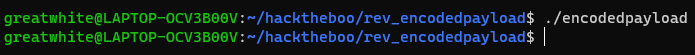
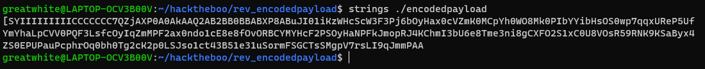
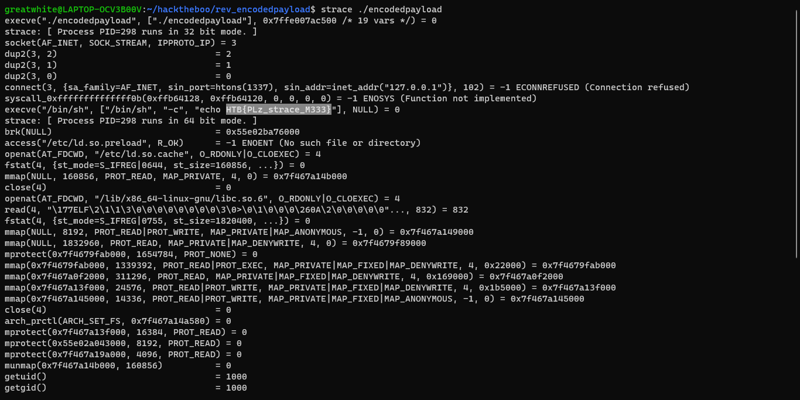

# Encoded Payload
@ChallengeAuthor:\
@WriteupAuthor:\
**DISCLAMER: I DO NOT OWN ANY OF THE FILES IN ```rev_encodedpayload.zip```.**

## Description
Buried in your basement you've discovered an ancient tome. The pages are full of what look like warnings, but luckily you can't read the language! What will happen if you invoke the ancient spells here?

## Solving The Challenge
Interestingly enough, the file, ```encodedpayload```, interacts with neither standard input nor standard output on execution.


Running the ```strings``` command on the file, we find nothing but garbage.


Lets run the [strace] command on the file to see what is going on in the background.

And there's our flag!!!

[MrSharkSpamBot]: https://github.com/MrSharkSpamBot
[strace]: https://github.com/strace/strace
