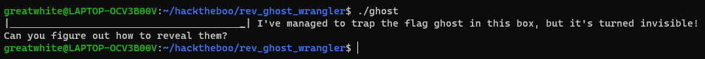

#  Ghost Wrangler
@ChallengeAuthor: clubby789 (Tony_Bamanaboni)\
@WriteupAuthor: [MrSharkSpamBot]\
**DISCLAMER: I DO NOT OWN ANY OF THE FILES IN ```rev_ghost_wrangler.zip```.**

## Description
Who you gonna call?

## Solving The Challenge
Let's run the ```file``` command on the ```ghost``` file to get general information about the file.

The file is not [stripped]. This will be usefull for later.

Let's run the ```strings``` command on the ```ghost``` file to find any interesting strings.

Nothing particularly interesting.

Let's run the 


[MrSharkSpamBot]: https://github.com/MrSharkSpamBot
[stripped]: https://en.wikipedia.org/wiki/Strip_(Unix)
[ghidra]: https://github.com/NationalSecurityAgency/ghidra
[strace]: https://github.com/strace/strace
